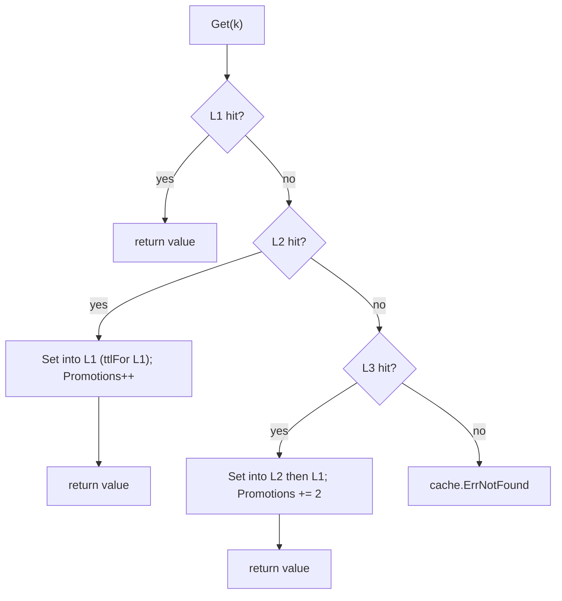
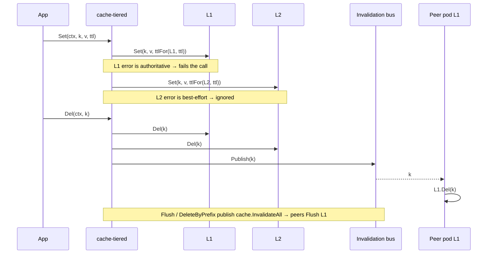

# ubgo/cache-tiered — tiered L1/L2/L3 cache for Go

Multi-tier (L1/L2/L3) cache composer for Go. It wraps several [`github.com/ubgo/cache`](https://github.com/ubgo/cache) backends into one cache that probes them fastest-first, promotes hits upward, writes through, and stays coherent across processes via a pluggable invalidation bus — and is itself a `cache.Cache`, so callers see no difference.

If you searched for "Go multi-level cache", "L1 L2 cache library Golang", "in-memory + Redis tiered cache Go", or "read-through cache promotion Go" — this is the tiered composer of the `ubgo/cache` family. It passes the shared `cachetest.Run` conformance suite.

## Why a tiered cache

A single in-memory cache is fast but per-process and lost on restart. A single Redis/Postgres cache is shared and durable but every read is a network round trip. A tiered cache gives you both: a nanosecond-latency local **L1** in front of a shared **L2** (and optionally a durable **L3**), with automatic promotion so hot keys stay local — and cross-process invalidation so a long L1 TTL never serves stale data after a peer mutates a key.

## Features

- **Read-promote.** Probe L1→Ln; the first hit is copied into every shallower tier so the next read is faster. `Promotions()` exposes the count for observability.
- **Write-through (default).** Writes go to every tier. The L1 error is authoritative; deeper-tier errors are best-effort so a cold/slow backend cannot break the hot path. `WriteOnlyL1` mode writes L1 only.
- **Per-tier TTL.** Run a short L1 TTL (bounds cross-pod staleness) and a long L2 TTL from one `Set` call.
- **Cross-process invalidation.** Plug any `cache.Invalidation` (e.g. Redis Pub/Sub from [`cache-redis`](https://github.com/ubgo/cache-redis)); mutations publish, peers drop their local L1 copy.
- **Atomic ops stay correct.** `SetNX`/`Incr`/`Decr` use L1 as the source of truth and mirror the result to deeper tiers.
- **Drop-in.** It *is* a `cache.Cache`; swap any single backend for a tiered one with no call-site changes.

## Install

```sh
go get github.com/ubgo/cache-tiered
```

Requires Go 1.24+.

## Quick start

```go
package main

import (
	"context"
	"log"
	"time"

	"github.com/redis/go-redis/v9"
	memcache "github.com/ubgo/cache-mem"
	rediscache "github.com/ubgo/cache-redis"
	tieredcache "github.com/ubgo/cache-tiered"
)

func main() {
	rdb := redis.NewClient(&redis.Options{Addr: "localhost:6379"})

	tc := tieredcache.New(
		tieredcache.WithL1(memcache.New()),               // ~100ns local hits
		tieredcache.WithL2(rediscache.New(rdb)),           // shared across pods
		tieredcache.WithPerTierTTL(map[int]time.Duration{
			1: 30 * time.Second, // bound L1 cross-pod staleness
			2: 5 * time.Minute,  // L2 lives longer
		}),
		tieredcache.WithInvalidation(rediscache.NewInvalidation(rdb, "cache:invalidate")),
	)
	defer tc.Close()

	ctx := context.Background()
	_ = tc.Set(ctx, "k", []byte("v"), time.Minute)
	b, err := tc.Get(ctx, "k") // L1 miss → L2 hit → promoted into L1
	if err != nil {
		log.Fatal(err)
	}
	log.Printf("%s", b)
}
```

## Constructor and options

### `New(opts ...Option) *Cache`

Builds the composer. **Panics if no L1 is configured** — a tiered cache without its hot tier is a construction bug, not a runtime condition, so it fails loudly at startup rather than silently degrading. Nil tiers passed via options are compacted out.

### `WithL1(c) / WithL2(c) / WithL3(c) Option`

Set the tiers, fastest (closest) first. L1 is required and authoritative for atomic ops; L2/L3 are optional. Each tier is any `cache.Cache` — mix mem + Redis + Postgres freely.

### `WithPerTierTTL(map[int]time.Duration) Option`

Per **1-based** tier TTL override used when writing or promoting into that tier. Tiers absent from the map use the caller-supplied TTL. `{1: 30*time.Second, 2: 5*time.Minute}` → L1 entries live 30s, L2 entries 5m, regardless of the TTL passed to `Set`.

### `WithWriteMode(WriteThrough | WriteOnlyL1) Option`

`WriteThrough` (default): `Set`/`SetMulti`/`Expire` propagate to all tiers. `WriteOnlyL1`: only L1 is written (deeper tiers fill lazily on later promotion).

### `WithInvalidation(inv cache.Invalidation) Option`

Wires a cross-process bus. The tiered cache then (a) subscribes and drops the affected key from **L1** when any peer publishes, and (b) publishes on `Del`/`DeleteByPrefix`/`Flush` so peers drop theirs. This is what lets L1 safely run a longer TTL. Delivery is best-effort. The subscribe goroutine is started by `New` and cleanly stopped by `Close`.

## Read-promotion path



A non-`ErrNotFound` error from any tier aborts the probe and is returned (a real backend failure is not a miss). Promotion writes are best-effort: a failed promote does not fail the `Get`.

## Write-through and invalidation



## Method reference

```go
ctx := context.Background()

b, err := tc.Get(ctx, "k")                       // probe + promote
m, err := tc.GetMulti(ctx, []string{"a", "b"})   // per-key Get
ok, err := tc.Has(ctx, "k")                      // first tier that has it
d, err := tc.TTL(ctx, "k")                       // first tier's reported TTL

err = tc.Set(ctx, "k", []byte("v"), time.Minute) // write-through (per-tier TTL)
err = tc.SetMulti(ctx, map[string]cache.Item{"a": {Value: []byte("1")}})
created, err := tc.SetNX(ctx, "k", []byte("v"), time.Minute) // L1 decides; mirrored down
err = tc.Expire(ctx, "k", time.Hour)             // cascades; per-tier not-found tolerated
err = tc.Touch(ctx, "k")

n, err := tc.Incr(ctx, "hits", 1)                // L1 authoritative; deeper tiers mirrored to n
n, err = tc.Decr(ctx, "hits", 2)

err = tc.Del(ctx, "a", "b")                      // cascade + publish per key
err = tc.DeleteByPrefix(ctx, "user:")            // cascade + publish InvalidateAll
err = tc.Flush(ctx)                              // cascade + publish InvalidateAll

it := tc.Iterate(ctx, cache.IterateOpts{Prefix: "user:"}) // deepest tier (fullest view)
defer it.Close()
for it.Next() { _ = it.Key(); _ = it.Value() }

err = tc.Ping(ctx)                               // first unhealthy tier
s := tc.Stats()                                  // hits/sets summed; entries from deepest tier
p := tc.Promotions()                             // deeper-hit-copied-upward count
err = tc.Close()                                 // idempotent; stops invalidation; closes each tier once
```

## FAQ

### What is an L1/L2/L3 cache and why use one in Go?

L1 is a fast process-local cache; L2/L3 are shared/durable backends. A tiered cache serves hot keys from L1 (nanoseconds) and falls back to L2/L3 on a miss, promoting the value back up. You get local latency with shared-cache consistency.

### How does promotion work?

On a read, the first tier that has the key returns it, and the value is written into every shallower tier (using that tier's TTL). The next read for that key is an L1 hit. `Promotions()` counts how often this happened.

### Why does `New` panic without an L1?

A tiered cache with no hot tier is meaningless and always a wiring mistake. Panicking at construction surfaces the bug at startup instead of silently behaving like a slow pass-through.

### How do I keep L1 coherent across pods?

`WithInvalidation` plus a bus like `rediscache.NewInvalidation`. Any `Del`/`Flush`/`DeleteByPrefix` publishes; every pod's subscriber drops the affected L1 key (or flushes L1 on `InvalidateAll`). This makes a longer L1 TTL safe.

### What happens if L2 is down?

Reads fall through to it, get an error that is not `ErrNotFound`, and the call surfaces it — but on the **write** path deeper-tier errors are best-effort: an L1 success still succeeds. Only an L1 error fails a write.

### Are `Incr`/`SetNX` correct across tiers?

Yes. L1 is the single source of truth for the atomic decision; the resulting value is mirrored down so deeper-tier reads stay consistent.

### Does `Close()` close the underlying caches?

Yes — `Close()` is idempotent, stops the invalidation goroutine, and closes every tier exactly once.

## Positioning vs other `ubgo/cache` adapters

| Adapter | Role | Latency | Cross-process invalidation | Best for |
|---|---|---|---|---|
| **cache-tiered** (this) | composes others | L1 ~ns, then L2/L3 | Yes (pluggable bus) | Hot-path latency + shared consistency |
| [cache-redis](https://github.com/ubgo/cache-redis) | single backend | network | Yes (Pub/Sub source) | Shared L2 |
| [cache-pg](https://github.com/ubgo/cache-pg) | single backend | network | No | Durable L3 |
| [cache-memcached](https://github.com/ubgo/cache-memcached) | single backend | network | No | Memcached interop tier |

## Contributing

See [CONTRIBUTING.md](./CONTRIBUTING.md) for the build/test/lint gate, the conformance contract, and the mem+mem Docker-free test setup.
