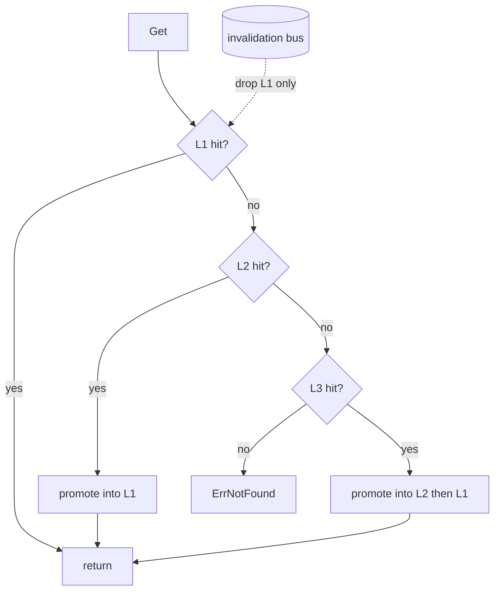

# cache-tiered — feature cookbook

Exhaustive, example-driven reference for every exported identifier in
`github.com/ubgo/cache-tiered` (package `tieredcache`).

Import path:

```go
import tieredcache "github.com/ubgo/cache-tiered"
```

`tieredcache.Cache` composes several `cache.Cache` backends into an L1/L2/L3
hierarchy and is itself a [`cache.Cache`](https://github.com/ubgo/cache), so
callers see no difference. It passes the shared `cachetest.Run` suite.

## Pages

- [Construction & options](construction.md) — `New`, `WithL1/L2/L3`, `WithPerTierTTL`, `WithWriteMode`, `WithInvalidation`, and the `Cache`/`Option`/`WriteMode` types + `WriteThrough`/`WriteOnlyL1` constants.
- [Read & write semantics](semantics.md) — promotion on read, write fan-out, atomic-op authority, cascade on delete, and `Promotions`.

## Capability matrix

| Exported symbol | Kind | Behavior | Page |
|---|---|---|---|
| `New` | constructor | panics without L1 | [Construction](construction.md#new) |
| `Cache` | type | the tiered composer | [Construction](construction.md#cache) |
| `Option` | type | functional option | [Construction](construction.md#option) |
| `WriteMode` | type | write-propagation enum | [Construction](construction.md#writemode) |
| `WriteThrough` | const | write to every tier (default) | [Construction](construction.md#writethrough) |
| `WriteOnlyL1` | const | write only to L1 | [Construction](construction.md#writeonlyl1) |
| `WithL1` | option | hot tier (required) | [Construction](construction.md#withl1) |
| `WithL2` | option | second tier | [Construction](construction.md#withl2) |
| `WithL3` | option | third tier | [Construction](construction.md#withl3) |
| `WithPerTierTTL` | option | per-tier TTL override (1-based) | [Construction](construction.md#withpertierttl) |
| `WithWriteMode` | option | select write strategy | [Construction](construction.md#withwritemode) |
| `WithInvalidation` | option | cross-process coherence bus | [Construction](construction.md#withinvalidation) |
| `Get` / `GetMulti` | method | probe L1→Ln, promote hits | [Semantics](semantics.md#read-path) |
| `Has` / `TTL` | method | first-tier match | [Semantics](semantics.md#has--ttl) |
| `Set` / `SetMulti` / `Expire` / `Touch` | method | fan-out (write mode) | [Semantics](semantics.md#write-path) |
| `SetNX` / `Incr` / `Decr` | method | L1 authoritative, mirror down | [Semantics](semantics.md#atomic-ops) |
| `Del` / `DeleteByPrefix` / `Flush` | method | cascade all tiers + publish inval | [Semantics](semantics.md#delete--flush) |
| `Iterate` | method | scans the deepest tier | [Semantics](semantics.md#iterate) |
| `Ping` / `Close` / `Stats` | method | aggregate across tiers | [Semantics](semantics.md#lifecycle) |
| `Promotions` | method | count of upward copies | [Semantics](semantics.md#promotions) |

## Topology


